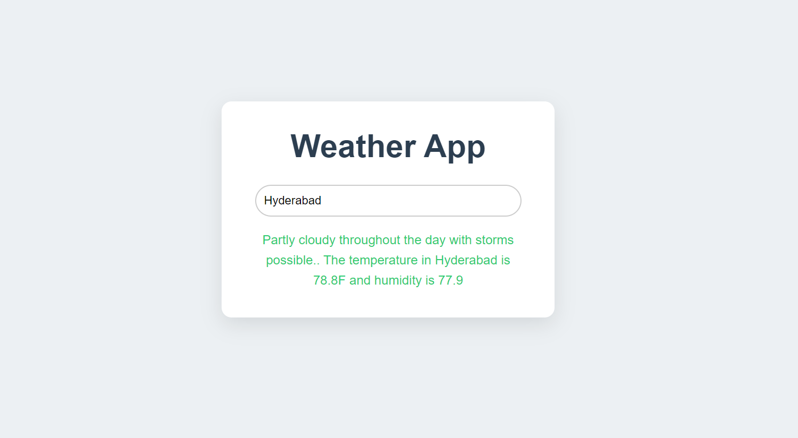

# Weather App

A simple weather application built using Node.js, Express, and EJS to display current weather information for a given location. The app fetches real-time weather data using the Visual Crossing Weather API.

## Features

- **Weather Search**: Users can input a location, and the app will display the temperature, humidity, and weather description.
- **Error Handling**: The app handles errors such as invalid locations or issues with the API request.
- **Dynamic User Interface**: Utilizes EJS for rendering dynamic HTML content, showing weather data or error messages based on user input.
  
## Technologies Used

- **Node.js**: Backend runtime environment.
- **Express.js**: Web framework for handling routes and HTTP requests.
- **EJS (Embedded JavaScript)**: Template engine for rendering dynamic HTML pages.
- **Visual Crossing Weather API**: Provides weather data based on the user's location.
  
## Project Structure

```
WEATHER-APP
│   ├── node_modules/         # Node.js dependencies.
│   ├── public/               # Public static assets like CSS and images.
│   │   └── css/              # Stylesheets for styling the app.
│   │       └── styles.css    # Main CSS file for custom styles.
│   ├── views/                # EJS templates for rendering HTML pages.
│   │   └── index.ejs         # Main page rendered to the user.
│   ├── .env                  # Environment variables for sensitive data.
│   ├── .gitignore            # Specifies files to be ignored by Git.
│   ├── app.js                # Main server application logic and routes.
│   ├── package.json          # Metadata and dependencies for the project.
│   ├── package-lock.json     # Lockfile for npm dependencies.
│   ├── README.md             # Project documentation and usage instructions.
│   ├── demo.png              # Example image used in the project.
│   └── utils.js              # Utility functions (e.g., for fetching weather data).
```

## Installation

1. Clone the repository:
   ```bash
   git clone https://github.com/HrudayGurijala/weather-app
   ```

2. Navigate to the project directory:
   ```bash
   cd weather-app
   ```

3. Install the required dependencies:
   ```bash
   npm install
   ```

## Running the Application

1. Start the server:
   ```bash
   node app.js
   ```

2. Open your browser and navigate to:
   `http://localhost:4000`

## Usage

1. Enter a location in the search box (e.g., "New York").
2. The app will display the temperature, humidity, and weather description for that location.
3. If the location is invalid, an error message will be shown.

## Weather API

The app uses the **Visual Crossing Weather API** to fetch weather data. You can view more about the API and its features [here](https://www.visualcrossing.com/).

To use this app with your own API key, create a .env file and store your api key in API_KEY variable:
```javascript
API_KEY="YOUR_API_KEY"
```
## Screenshots

### Displaying Search Results



## Contributing

Feel free to fork this repository and submit a pull request if you want to contribute to this project.

## License

This project is licensed under the MIT License.

## Contact

If you have any questions, feel free to reach out:

- **Email**: [gurijalahruday@gmail.com](mailto:gurijalahruday@gmail.com)

